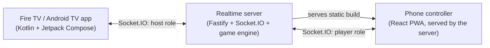
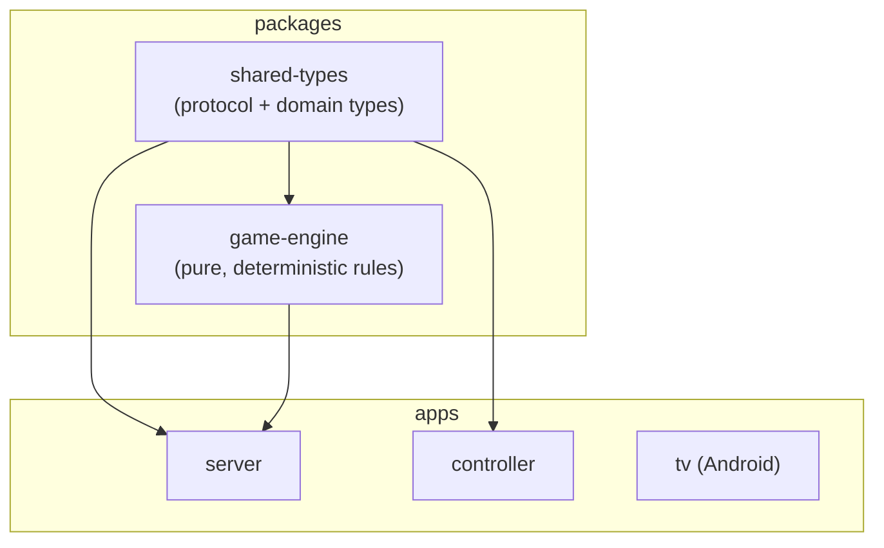

# BUMP RUN

An original, Jackbox-style multiplayer race-and-bump board game. The TV (Fire TV /
Android TV) is the shared game board; players join from their own phone browsers --
no app install required -- by scanning a QR code or typing a short room code.

> **Working title.** "BUMP RUN" is a placeholder name pending trademark clearance.
> It is centralized in [`packages/shared-types/src/appConfig.ts`](packages/shared-types/src/appConfig.ts)
> so the whole product can be renamed from one file.

## What it is

- 2-4 players, 4 pawns each, racing from **Start** around a shared track, into their
  own protected **safety lane**, and **Home**.
- An original movement-card deck: forward/backward moves, a split-7, swaps, bumping,
  a special **BUMP!** card, and data-driven **BOOST** lanes.
- The server is the sole authority over game state. Clients only ever send intent
  ("I want to draw", "I want to move this pawn here") and the server validates and
  broadcasts the result.
- Players reconnect to their same seat after a refresh, backgrounded tab, or dropped
  Wi-Fi, via a token stored in their browser.

See [`docs/game-rules.md`](docs/game-rules.md) for the full ruleset.

## Architecture





Full details: [`docs/architecture.md`](docs/architecture.md). Wire protocol:
[`docs/protocol.md`](docs/protocol.md).

## Folder structure

```
apps/
  server/       Fastify + Socket.IO realtime server, serves the controller build too
  controller/   React + Vite phone controller (PWA)
  tv/           Android TV / Fire TV app (Kotlin + Jetpack Compose)
packages/
  shared-types/ Domain types + typed socket protocol, shared by server & controller
  game-engine/  Deterministic, pure-function game rules engine (+ test suite)
docs/           Architecture, rules, protocol, Fire TV install, deployment, testing
scripts/        Windows/cross-platform dev & install helpers
```

## Prerequisites (Windows)

- **Node.js** 20+ and **pnpm** (`corepack enable` or `npm install -g pnpm`)
- **Java 17** (Eclipse Temurin recommended) -- needed only to build the Android app
- **Android SDK command-line tools** (`platform-tools`, `platforms;android-34`,
  `build-tools;34.0.0`) -- needed only to build the Android app
- A Fire TV / Fire Stick or Android TV device on the same Wi-Fi as your PC, with
  ADB debugging enabled (see [`docs/fire-tv-install.md`](docs/fire-tv-install.md))

You do **not** need Android Studio -- everything below uses the command line.

## Install dependencies

```bash
pnpm install
```

## Start the local server (LAN mode)

This detects your PC's LAN IP automatically so your phone and Fire TV (on the same
Wi-Fi) can reach it:

```bash
pnpm run build:server
pnpm run build:controller
pnpm run dev:lan
```

It prints something like:

```
BUMP RUN -- LAN development mode
  Your LAN address:   192.168.1.50
  Server + Controller: http://192.168.1.50:3000
```

If phones or the Fire TV can't connect, check Windows Firewall: **Windows Defender
Firewall -> Allow an app through firewall** and allow Node.js on private networks.

## Open the phone controller

Visit the printed URL on your phone's browser (or scan the QR code the TV app shows
once a room exists): `http://<your-lan-ip>:3000`.

## Build the TV app (Fire TV / Android TV)

```bash
pnpm run apk:debug
```

This runs the Gradle wrapper in `apps/tv`. The debug APK lands at:

```
apps/tv/app/build/outputs/apk/debug/app-debug.apk
```

Install it on your Fire TV:

```bash
.\scripts\install-firetv.ps1 -DeviceIp 192.168.1.123
```

Full walkthrough (enabling developer options, ADB, etc.):
[`docs/fire-tv-install.md`](docs/fire-tv-install.md).

### Configuring the server address on the TV

On first launch, open **SETTINGS** on the TV and enter your PC's LAN URL (the one
`dev:lan` printed). This is saved locally so you only need to do it once per network.

## Run tests

```bash
pnpm test
```

Runs the game engine's 69 tests (including a random-play full-game simulation across
multiple seeds) and the server's 17 integration tests (real Socket.IO connections,
reconnect races, private-state leak checks). See [`docs/testing.md`](docs/testing.md).

## Build for production

```bash
pnpm run build
```

Docker deployment and signed release builds: [`docs/deployment.md`](docs/deployment.md).

## GitHub workflow

CI runs lint/typecheck/test/build on every push and PR
(`.github/workflows/ci.yml`), and builds a debug APK artifact on tags matching
`v*` (`.github/workflows/release.yml`).

## Troubleshooting

| Symptom | Likely cause |
|---|---|
| Phone shows "That room no longer exists" | TV app was restarted (new room) after the phone last loaded the join link -- rescan the QR code |
| Fire TV stuck on "Connecting to server…" | Wrong server URL in Settings, or Windows Firewall blocking the port |
| `pnpm run apk:debug` fails with "SDK location not found" | Create `apps/tv/local.properties` with `sdk.dir=C:\\Android\\Sdk` (or wherever your SDK lives) |
| Controller shows blank page after a rebuild | Restart the server process, or confirm it was built with the static-file fix (wildcard serving) in `apps/server/src/index.ts` |

More in each app's section above and in `docs/`.
