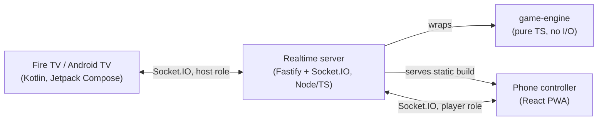
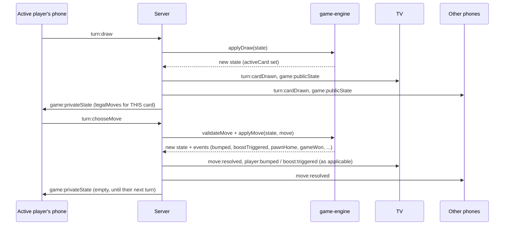

# Architecture

## Components

- **`packages/game-engine`** is a pure, dependency-free TypeScript package. Every
  function is deterministic given its inputs (including a seeded PRNG for shuffles),
  has no network/DB/filesystem access, and is the single source of truth for every
  rule in the game. It's covered by its own test suite independent of the server.
- **`apps/server`** owns all authoritative state: rooms, players, reconnect tokens,
  and the live `GameState` for each room's game (produced by calling into
  `game-engine`). It never trusts a client's claim about whose turn it is or what
  move is legal -- every socket event is re-validated server-side.
- **`apps/controller`** is a thin client: it renders whatever the server tells it
  (public state + the private `legalMoves` list for whoever's socket it is) and
  sends intents (`turn:draw`, `turn:chooseMove`, ...). It has zero game-rule logic.
- **`apps/tv`** is likewise a thin client, but always in the "host" role for the
  room it creates. It renders public state only -- it never receives or needs
  private per-player data.
- **`packages/shared-types`** is imported by the server and the controller (the TV
  app is a separate Kotlin/Gradle project and can't import TS directly, so its
  `net/Protocol.kt` hand-mirrors the subset of fields it needs to render).

## Why a monorepo

Keeping the engine, server, and controller in one pnpm workspace means a single
`GameState`/`MoveOption` type definition flows from engine -> server -> controller
with full type-checking across that whole path. The Android app can't share that
TypeScript directly, so its Kotlin data classes in `net/Protocol.kt` are a
deliberate, documented duplication -- keep them in sync with `packages/shared-types`
if the wire protocol changes.

## State flow for a single turn

## Room storage

`apps/server/src/rooms/RoomStore.ts` defines `IRoomStore`, implemented in-memory
(`InMemoryRoomStore`) for V1. This is a deliberate, documented choice: a single
Node process holding rooms in memory is simple and sufficient for a casual party
game. If horizontal scaling or crash-resilience is ever needed, swap in a Redis- or
database-backed implementation of the same interface -- nothing else in the
codebase needs to change.

## Public vs. private state

`serializePublicState` strips the raw deck order and RNG seed (either would let a
client predict future draws) and is broadcast to everyone in the room, TV included.
`getLegalMoves` output is sent *only* to the current player's own socket, via
`io.to(socketId).emit(...)`, never a room-wide broadcast -- see
`RoomService.sendPrivateStateIfCurrentPlayer`. This is covered by a server
integration test that connects two real player sockets and asserts the non-active
player never receives a `game:privateState` event.

## Reconnect

Each player gets a random `reconnectToken` on join, stored in the room's player
record and in the browser's `localStorage`. On disconnect, the player's socket
reference is cleared but their seat/progress is kept. On `room:reconnect` with a
valid token, the server re-attaches the new socket to the existing player record
and immediately re-sends `room:state` + (if a game is running) `game:publicState`
and `game:privateState` -- so a refreshed phone lands back in the right screen
automatically (see `useGameSocket`'s `room:state`-driven phase derivation).

The TV similarly gets a `hostToken` on `room:create` and can pass it back on a
later `room:create` call to reattach to the same room (instead of creating an
empty new one) if its connection drops.
